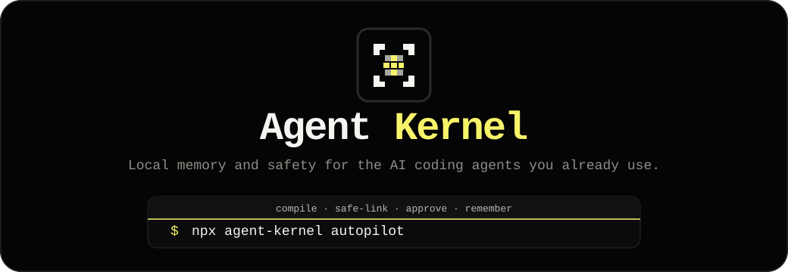

<div align="center">


<h1>Agent Kernel</h1>

<p><strong>Lightweight local memory and safety for the AI coding agents you already use.</strong></p>

<p>
Install once. Give Claude Code, Codex, Cursor, Gemini CLI, OpenCode, Antigravity, and AGENTS.md-compatible tools one shared source of truth for repo rules, user preferences, workflows, debugging lessons, guard policies, and generated agent instructions.
</p>

<p>
  <a href="https://www.npmjs.com/package/@mamdouh-aboammar/agent-kernel"></a>
  <a href="https://www.npmjs.com/package/@mamdouh-aboammar/agent-kernel"></a>
  <a href="https://bundlephobia.com/package/@mamdouh-aboammar/agent-kernel"></a>
  <a href="https://github.com/imMamdouhaboammar/agent-kernel/actions/workflows/ci.yml"></a>
  
  
  <a href="./LICENSE"></a>
</p>



</div>

---

## Why you would install this

AI coding agents are useful, but most sessions still start with missing context. The agent forgets your repo rules, repeats old mistakes, runs commands you already warned against, or fixes a bug once and then loses the lesson.

Agent Kernel gives those agents a small local operating layer.

| Recurring problem | What Agent Kernel gives you |
|---|---|
| You repeat the same rules in every prompt | Durable local memory compiled into agent-readable files |
| Claude, Codex, Cursor, and Gemini drift from each other | One source of truth distributed to each surface |
| The same build or test failure comes back | Failure Lessons that capture command, error, root cause, and fix |
| Agents find useful project rules but should not silently save them | Proposal inbox with user approval before publish |
| Existing `AGENTS.md`, `CLAUDE.md`, or Cursor rules might be damaged | Safe linking with dry-run mode and marked blocks |
| You do not want a heavy platform | A Node CLI, local JSON files, optional hooks, optional MCP |

The practical gain: keep using your current agents, but stop making each one relearn the same project context from scratch.

---

## What you gain without losing control

Agent Kernel is not another coding agent. It does not replace Claude Code, Codex, Cursor, Gemini CLI, OpenCode, Antigravity, or any AGENTS.md-compatible tool.

It sits around them as a local control layer:

```text
your rules, preferences, workflows, notes, policies, and failure lessons
  -> local Agent Kernel source JSON
  -> compile and safe-link
  -> AGENTS.md, CLAUDE.md, GEMINI.md, Cursor rules, Codex files, Antigravity files
  -> agents start with better context next run
```

The approval boundary stays explicit:

```text
agent notices a durable lesson
  -> agent proposes memory or captures failure evidence
  -> you review the inbox
  -> you approve only what should last
  -> Agent Kernel publishes updated guidance
```

Autopilot here means repeated context work is automated. Approval stays human-owned.

---

## Lightweight by design

When you install Agent Kernel, you are not taking on a large system.

It is currently:

- one npm package
- a local `~/.agent-kernel/` folder
- JSON-first storage
- generated markdown and config surfaces
- optional git hooks
- optional local stdio MCP server
- zero runtime npm dependencies

It is not:

- a hosted memory service
- a database server
- a cloud account
- a background daemon by default
- a replacement for tests, CI, or code review
- a secret store

---

## Install

```bash
npm install -g @mamdouh-aboammar/agent-kernel
agent-kernel --version
agent-kernel doctor
```

Run without global install:

```bash
npx -y @mamdouh-aboammar/agent-kernel --version
```

Requires Node.js `>=18.18.0`.

---

## Fastest safe setup

Use this path for an existing repository. It shows changes first, preserves hand-written instructions, and writes Agent Kernel content only inside marked blocks.

```bash
cd ~/Projects/YourProject

agent-kernel init --sync --enforce
agent-kernel compile
agent-kernel-safe-link . --dry-run
agent-kernel-safe-link .
agent-kernel-safe-git-hook . --dry-run
agent-kernel-safe-git-hook .
agent-kernel doctor
```

Typical project-local outputs:

```text
AGENTS.md                              # Claude Code, Codex, Cursor, OpenCode fallback guidance
CLAUDE.md                              # Claude Code guidance
.cursor/rules/00-agent-kernel.mdc      # Cursor rule
.codex/AGENTS.md                       # Codex guidance
.codex/config.toml                     # Codex config
.agents/agents.md                      # Antigravity-style guidance
.agents/skills/README.md               # Antigravity-style skills index
GEMINI.md                              # Gemini CLI guidance
.git/hooks/pre-commit                  # Optional guard checks when installed
```

For clean or controlled projects, the direct path is also available:

```bash
agent-kernel link . --hooks
```

For existing repositories, prefer safe-link first.

---

## Does every agent automatically know it exists?

No. Agent Kernel is local and explicit.

An agent knows about it after one of these happens:

1. You safe-link generated guidance into the project.
2. The agent reads a standard surface such as `AGENTS.md`, `CLAUDE.md`, `GEMINI.md`, or Cursor rules.
3. You configure the local MCP server for an agent that supports MCP.
4. You install hooks that run Agent Kernel helper commands at specific lifecycle points.

That is intentional. Agent Kernel should be visible, reviewable, and easy to remove from a project if you decide not to use it there.

---

## Core workflows

### Save a durable rule

Use `remember` when you are acting as the user:

```bash
agent-kernel remember "Never add local SQLite fallback to production Supabase apps." \
  --type policy \
  --level critical \
  --tags supabase,database \
  --publish
```

When an agent finds a useful rule, it should propose it instead:

```bash
agent-kernel propose \
  --from claude \
  --text "Use pnpm in this repository." \
  --reason "User corrected the package manager during setup."

agent-kernel inbox
agent-kernel approve <proposal-id> --publish
```

### Turn repeated errors into Failure Lessons

Capture the useful parts of a failure:

```bash
agent-kernel failure capture \
  --from claude \
  --type test-failure \
  --command "npm test" \
  --exit-code 1 \
  --text "ERR_MODULE_NOT_FOUND ..." \
  --root-cause "Node ESM import path missed its explicit extension." \
  --fix "Add the explicit .js extension to the relative import."
```

Search before retrying a familiar issue:

```bash
agent-kernel failure search "ERR_MODULE_NOT_FOUND"
```

Promote a recurring lesson into reviewable memory:

```bash
agent-kernel failure propose <failure-lesson-id> --as rule
agent-kernel inbox
agent-kernel approve <proposal-id> --publish
```

Repeated captures of the same `project + command + errorSignature` update the existing lesson and increment `occurrences` instead of creating noisy duplicates.

For Claude Code automatic capture, see [`docs/hooks/FAILURE_LESSONS_HOOK.md`](./docs/hooks/FAILURE_LESSONS_HOOK.md). The recommended event is `PostToolUseFailure` with exec-form command hooks.

### Capture project history as episodes

```bash
agent-kernel episode add \
  --title "Stripe webhook bug fix" \
  --tags stripe,webhook,bug \
  --text "Root cause: missing signature verification on /api/stripe webhook. Fix: verify signature via stripe.webhooks.constructEvent()."
```

Later:

```bash
agent-kernel episode search "stripe webhook"
agent-kernel episode show <episode-id>
```

Episodes are useful for investigation notes, decisions, and debugging context that should be searchable but does not necessarily belong as a permanent rule.

---

## Planned: Bundle your KB

Knowledge Bundle is a planned sharing layer for Agent Kernel.

The idea: package approved memory, Failure Lessons, policies, skills, workflows, and selected episodes into one portable `.akb` file. Another user can inspect it, diff it against their local memory, import it to their review inbox, approve selected items, then publish and link the result into their own agent surfaces.

Proposed command shape:

```bash
agent-kernel bundle create ./team-agent-kernel.akb --scope approved --redact
agent-kernel bundle inspect ./team-agent-kernel.akb
agent-kernel bundle diff ./team-agent-kernel.akb
agent-kernel bundle import ./team-agent-kernel.akb --to inbox
agent-kernel bundle install ./team-agent-kernel.akb --review --publish --link .
```

Default behavior should be review-first. A bundle should not silently overwrite another user's approved memory.

See [`docs/BUNDLE_KB.md`](./docs/BUNDLE_KB.md).

---

## Command surface

### Core CLI

```text
agent-kernel init [--sync] [--enforce]
agent-kernel doctor
agent-kernel compile
agent-kernel sync
agent-kernel link [project] [--hooks]
agent-kernel remember "rule text" [--type rule] [--level critical] [--publish]
agent-kernel propose --from claude --text "rule text" --reason "..."
agent-kernel inbox
agent-kernel approve <id> [--publish]
agent-kernel reject <id>
agent-kernel publish
agent-kernel validate
agent-kernel migrate json [--publish]
agent-kernel memory list|search|show
agent-kernel episode add|sync|search|show|stats|reindex
agent-kernel failure capture|learn|list|search|show|propose|promote|validate
agent-kernel enforce install
agent-kernel guard [--staged|--file path]
agent-kernel git-hook install [project]
agent-kernel mcp serve|config|install
agent-kernel start <claude|codex|cursor|antigravity|gemini> [project]
agent-kernel status
```

### Helper binaries

```text
agent-kernel-safe-link
agent-kernel-safe-git-hook
agent-kernel-agent-propose
agent-kernel-failure
agent-kernel-failure-hook
agent-kernel-mode
agent-kernel-agent-write
ak
```

---

## Memory layout

```text
~/.agent-kernel/
  config.json
  source/
    memories/
      rules.json
      preferences.json
      workflows.json
      project-notes.json
      skills.json
    failures/
      failure-lessons.json
    policies/
      policies.json
    schemas/
  episodes/
    archive/
    index.json
    sources.json
  inbox/
    pending/
    approved/
    rejected/
  dist/
    AGENTS.md
    CLAUDE.md
    cursor-rule.mdc
    antigravity-agents.md
    GEMINI.md
    SKILLS.md
    policy.json
  logs/
    compile.jsonl
    sync.jsonl
    proposals.jsonl
    approvals.jsonl
    episodes.jsonl
    failures.jsonl
```

Generated files in `dist/` are disposable. Source JSON, proposals, episodes, policies, and Failure Lessons are canonical.

---

## Agent integrations

| Agent or surface | Output or integration |
|---|---|
| Claude Code | `CLAUDE.md`, hooks, MCP config, marketplace plugin metadata |
| Codex | `AGENTS.md`, `.codex/AGENTS.md`, `.codex/config.toml`, repo-local skills |
| Cursor | `.cursor/rules/00-agent-kernel.mdc` |
| OpenCode / AGENTS-compatible agents | `AGENTS.md` |
| Antigravity | `.agents/agents.md`, `.agents/skills/*` |
| Gemini CLI | `GEMINI.md` |
| Skills.sh | `SKILL.md`, `skills.sh.json` |

Repo-local ECC scaffolds:

```text
.claude/ecc-tools.json
.claude/skills/agent-kernel/SKILL.md
.claude/commands/*.md
.claude/identity.json
.claude/homunculus/instincts/inherited/agent-kernel-instincts.yaml
.codex/AGENTS.md
.codex/config.toml
.codex/agents/*.toml
.agents/skills/agent-kernel/SKILL.md
.agents/skills/agent-kernel/agents/openai.yaml
```

Keep credentials and private MCP details in user-level config, not in repo-local ECC files.

---

## Safety model

- Agents may propose memories. Only Agent Kernel publishes approved memories.
- Failure Lessons capture evidence first. Promotion creates a pending proposal, not approved memory.
- Hooks are lifecycle adapters, not hidden agents.
- Critical rules should also be backed by permissions, guard checks, git hooks, or CI.
- Repo-local configs are reviewable execution surfaces. Keep them minimal and credential-free.
- Built-in guards include dangerous `rm -rf`, `curl | sh`, recursive `chmod 777`, force-push to main, `.git` deletion, and common secret patterns.

---

## Documentation map

Start with [`docs/README.md`](./docs/README.md).

| Need | Read |
|---|---|
| Install and connect agents | [`docs/INSTALL_AND_AGENT_SETUP.md`](./docs/INSTALL_AND_AGENT_SETUP.md) |
| Understand the operating model | [`docs/OPERATING_MODEL.md`](./docs/OPERATING_MODEL.md) |
| Current architecture | [`docs/ARCHITECTURE_NOW.md`](./docs/ARCHITECTURE_NOW.md) |
| Troubleshoot setup or runtime issues | [`docs/TROUBLESHOOTING.md`](./docs/TROUBLESHOOTING.md) |
| AI agent contributor runbook | [`docs/AGENT_RUNBOOK.md`](./docs/AGENT_RUNBOOK.md) |
| Memory and approval protocol | [`docs/MEMORY_PROTOCOL.md`](./docs/MEMORY_PROTOCOL.md) |
| Failure Lessons | [`docs/FAILURE_LESSONS_PROTOCOL.md`](./docs/FAILURE_LESSONS_PROTOCOL.md) |
| Knowledge Bundle plan | [`docs/BUNDLE_KB.md`](./docs/BUNDLE_KB.md) |
| Safe project linking | [`docs/SAFE_LINKING.md`](./docs/SAFE_LINKING.md) |
| Claude failure hook | [`docs/hooks/FAILURE_LESSONS_HOOK.md`](./docs/hooks/FAILURE_LESSONS_HOOK.md) |
| Claude hook best practices | [`docs/hooks/CLAUDE_HOOKS_BEST_PRACTICES.md`](./docs/hooks/CLAUDE_HOOKS_BEST_PRACTICES.md) |
| MCP server | [`docs/MCP_SERVER.md`](./docs/MCP_SERVER.md) |
| Agent integrations | [`docs/INTEGRATIONS.md`](./docs/INTEGRATIONS.md) |
| Guard/strict mode | [`docs/STRICT_MODE.md`](./docs/STRICT_MODE.md) |
| JSON-first storage | [`docs/JSON_FIRST_STORAGE.md`](./docs/JSON_FIRST_STORAGE.md) |

---

## Development

```bash
git clone https://github.com/imMamdouhaboammar/agent-kernel
cd agent-kernel

npm install
npm run build
npm test
npm run lint
npm run typecheck
npm run size
npm run publish:dry
```

### Project layout

```text
agent-kernel/
├── src/cli.mjs              # Core CLI source, single ESM file
├── dist/cli.mjs             # Built CLI copied from src by scripts/build.mjs
├── bin/                     # Public wrappers and helper binaries
├── scripts/                 # Build, lint, version checks
├── test/                    # Smoke orchestrator and focused test modules
├── docs/                    # Architecture and protocol docs
├── docs/brand/              # Lightweight README and marketing SVG assets
├── examples/                # CI guard workflow and samples
├── development/             # Roadmap
├── .claude/                 # Repo-local ECC artifacts and Claude workflow commands
├── .codex/                  # Repo-local Codex baseline and role configs
├── .agents/skills/          # Codex-facing generated repo skill
├── .github/workflows/       # CI and release automation
├── .claude-plugin/          # Claude Code marketplace manifest
├── SKILL.md                 # Skills.sh and Claude marketplace discovery
├── skills.sh.json           # Skills.sh grouping metadata
├── package.json             # npm metadata
├── tsconfig.json            # TypeScript config
├── CHANGELOG.md             # Version history
├── LICENSE                  # MIT
└── README.md
```

### Adding a command or integration

1. Edit the current runtime surface: `src/cli.mjs` for core commands or a focused `bin/` helper for intentionally standalone behavior.
2. Update help output, README, `docs/ARCHITECTURE_NOW.md`, and the relevant protocol doc.
3. Add or update a focused smoke test and wire it through `test/smoke.mjs`.
4. Run `npm run build && npm test && npm run lint && npm run typecheck`.

---

## Contributing

See [`CONTRIBUTING.md`](./CONTRIBUTING.md).

1. Branch from `master`.
2. Make focused commits.
3. Keep code, tests, docs, and discovery metadata aligned.
4. Open a PR with a clear description of what changed and why.

---

## Links

- npm: https://www.npmjs.com/package/@mamdouh-aboammar/agent-kernel
- Repository: https://github.com/imMamdouhaboammar/agent-kernel
- Issues: https://github.com/imMamdouhaboammar/agent-kernel/issues
- Releases: https://github.com/imMamdouhaboammar/agent-kernel/releases
- Skills.sh: https://skills.sh/imMamdouhaboammar/agent-kernel
- delegate-team integration: https://github.com/imMamdouhaboammar/delegate-team/blob/master/integrations/agent-kernel.md

## License

MIT © Mamdouh Aboammar

---

<div align="center">

*Built by [Mamdouh Aboammar](https://github.com/imMamdouhaboammar) for everyone who is tired of explaining the same standards to a new agent every morning.*

</div>
