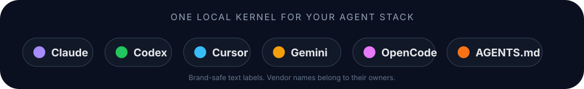

<div align='center'>


<h1>Agent Kernel</h1>

<p><strong>Local memory, trust boundaries, and architecture controls for the AI coding agents you already use.</strong></p>

<p>
Install once. Give Claude Code, Codex, Cursor, Gemini CLI, OpenCode, Antigravity, and AGENTS.md-compatible tools one shared source of truth for repository rules, user preferences, workflows, debugging lessons, architecture policies, and generated agent instructions.
</p>

<p>
  <a href='https://www.npmjs.com/package/@mamdouh-aboammar/agent-kernel'></a>
  <a href='https://www.npmjs.com/package/@mamdouh-aboammar/agent-kernel'></a>
  <a href='https://bundlephobia.com/package/@mamdouh-aboammar/agent-kernel'></a>
  <a href='https://github.com/imMamdouhaboammar/agent-kernel/actions/workflows/ci.yml'></a>
  
  
  <a href='./LICENSE'></a>
</p>

<p>
  <strong>Current stable release: <a href='https://www.npmjs.com/package/@mamdouh-aboammar/agent-kernel'>v1.9.0</a></strong><br />
  Trust-aware agent proposal and runtime capture helpers, transaction-safe project linking, worktree-safe Git hooks, retention controls, redacted export and import, and local reporting.
</p>



</div>

---

## Why install Agent Kernel

AI coding agents are useful, but most sessions still begin with missing context. The agent forgets repository rules, repeats old mistakes, runs commands you already rejected, or produces working code that quietly weakens the architecture.

Agent Kernel adds a small local operating layer around those tools.

| Recurring problem | What Agent Kernel provides |
|---|---|
| You repeat the same rules in every prompt | Durable local memory compiled into agent-readable files |
| Claude, Codex, Cursor, and Gemini drift from each other | One source of truth distributed to each supported surface |
| The same build or test failure returns | Failure Lessons with command, error, root cause, fix, and evidence |
| AI-generated code creates hidden dependency drift | Architecture Guardian with maps, policies, contracts, baselines, exceptions, and reports |
| An agent creates a second service or validator that already exists | Reuse-first symbol search before new capabilities are introduced |
| Agents identify useful rules but should not save them silently | A pending proposal inbox with explicit user approval |
| Existing AGENTS.md, CLAUDE.md, or Git hooks may be damaged | Dry-run-first, marker-aware, atomic installers |
| Local runtime evidence grows indefinitely | Retention status, explicit pruning, deterministic compaction, and local reports |
| You need to move or inspect local state | Redacted exports, review-first imports, replacement backups, and static HTML reports |
| You do not want a hosted platform | A Node CLI, local JSON files, optional hooks, optional MCP, and zero runtime dependencies |

The practical result is simple: keep using your current agents without making every session relearn the same standards, failures, and architecture boundaries.

---

## What Agent Kernel is

Agent Kernel is not another coding agent. It does not replace Claude Code, Codex, Cursor, Gemini CLI, OpenCode, Antigravity, or any AGENTS.md-compatible tool.

It sits around them as a local governance layer:

```text
your rules, preferences, workflows, project notes, policies, failure lessons,
and reviewed architecture constraints
  -> local Agent Kernel JSON and project-local architecture state
  -> compile, safe-link, hooks, MCP, retention, and conformance checks
  -> AGENTS.md, CLAUDE.md, GEMINI.md, Cursor rules, Codex files, reports
  -> agents start with better context and clearer boundaries
```

The approval boundary stays explicit:

```text
agent notices a durable lesson
  -> agent captures evidence or creates a pending proposal
  -> user reviews the inbox, policy, contract, baseline, or exception
  -> user approves only what should last
  -> Agent Kernel publishes guidance or enforces the reviewed boundary
```

Autopilot here means repeated context and checking work can be automated. Approval remains user-owned.

---

## Lightweight by design

Agent Kernel is currently:

- one npm package
- a local `~/.agent-kernel/` home
- project-local `.agent-kernel/architecture/` state when Architecture Guardian is used
- JSON-first storage
- generated Markdown and config surfaces
- optional Git and Claude hooks
- optional local stdio MCP server
- optional local daemon for live context capture
- zero runtime npm dependencies

It is not:

- a hosted memory service
- a database server
- a cloud account
- a background daemon by default
- a replacement for tests, CI, code review, or architecture decisions
- a secret store

---

## Install

```bash
npm install -g @mamdouh-aboammar/agent-kernel
agent-kernel --version
agent-kernel doctor
```

Run without a global install:

```bash
npx -y @mamdouh-aboammar/agent-kernel --version
```

Requires Node.js `>=18.18.0`.

Read [`docs/INSTALL_AND_AGENT_SETUP.md`](./docs/INSTALL_AND_AGENT_SETUP.md) for the complete setup path.

---

## Fastest safe setup

Use this flow for an existing repository. It previews changes, preserves hand-written instructions, and writes Agent Kernel content only inside managed blocks.

```bash
cd ~/Projects/YourProject

agent-kernel init --sync --enforce
agent-kernel compile
agent-kernel-safe-link . --dry-run
agent-kernel-safe-link .
agent-kernel-safe-git-hook . --dry-run
agent-kernel-safe-git-hook .
agent-kernel doctor
```

Typical project-local outputs:

```text
AGENTS.md                              # AGENTS-compatible guidance
CLAUDE.md                              # Claude Code guidance
.cursor/rules/00-agent-kernel.mdc      # Cursor rule
.codex/AGENTS.md                       # Codex guidance
.codex/config.toml                     # Codex config
.agents/agents.md                      # Antigravity-style guidance
.agents/skills/README.md               # Antigravity-style skills index
GEMINI.md                              # Gemini CLI guidance
.git/hooks/pre-commit                  # Optional staged-file guard
```

For a clean or controlled project, the direct path is also available:

```bash
agent-kernel link . --hooks
```

For an existing repository, prefer the safe installers first:

- [`docs/SAFE_LINKING.md`](./docs/SAFE_LINKING.md)
- [`docs/SAFE_GIT_HOOKS.md`](./docs/SAFE_GIT_HOOKS.md)

---

## Trust-aware agent writes

Agent Kernel separates durable memory proposals from ephemeral runtime capture.

| Trust level | Read | Capture sessions | Propose memory | Direct approved memory |
|---|---:|---:|---:|---:|
| `read-only` | yes | no | no | no |
| `capture-only` | yes | yes | no | no |
| `propose-only` | yes | yes | yes | no |
| `trusted-local` | yes | yes | yes | limited governed actions only |

Unknown agents receive a transient `read-only` identity. A denied lookup does not silently register the agent.

Inspect or set a mode explicitly:

```bash
agent-kernel-agent-write mode list
agent-kernel-agent-write mode get cursor
agent-kernel-agent-write mode set cursor capture-only
```

Create a pending memory proposal from an allowed agent:

```bash
agent-kernel-agent-propose \
  --from codex \
  --reason 'The user corrected this workflow twice.' \
  --text 'Always run the documented verification command before claiming completion.'
```

Capture runtime evidence without publishing durable memory:

```bash
agent-kernel-agent-write session-start --agent cursor --project agent-kernel
agent-kernel-agent-write observe \
  --agent cursor \
  --session <session-id> \
  --type test_failure \
  --command 'npm test' \
  --exit-code 1 \
  --text 'The smoke suite failed during command routing.'
agent-kernel-agent-write session-end --agent cursor --session <session-id>
```

Both helpers reject unknown or duplicate options, ambiguous text sources, invalid fields, and unsafe identifiers before invoking the core runtime. Structured output is available with `--json`.

Read:

- [`docs/AGENT_PROPOSALS.md`](./docs/AGENT_PROPOSALS.md)
- [`docs/AGENT_WRITE_MODES.md`](./docs/AGENT_WRITE_MODES.md)

---

## Architecture Guardian

Architecture Guardian prevents working code from hiding structural regressions. It maps source dependencies, checks reviewed boundaries, searches existing capabilities, distinguishes old debt from new violations, and can block writes outside an active change contract.

Start in review mode:

```bash
cd ~/Projects/YourProject

agent-kernel architecture init .
# Review and edit .agent-kernel/architecture/policy.json
agent-kernel architecture policy validate .
agent-kernel architecture discover . --json
agent-kernel architecture baseline . --json
```

Before a non-trivial change:

```bash
agent-kernel architecture contract init . \
  --task 'Add subscription cancellation' \
  --owner billing \
  --allow 'src/billing/**,test/billing/**' \
  --expect 'src/billing/cancel-subscription.ts,test/billing/cancel-subscription.test.ts' \
  --tests 'cancel active subscription,idempotent cancellation'

agent-kernel architecture reuse 'cancel subscription' . --json
agent-kernel architecture check . --json
```

Use strict mode for a blocking local or CI gate:

```bash
agent-kernel architecture check . --base origin/master --strict --json
```

Architecture Guardian includes:

- source-root-scoped architecture maps
- local dependency and circular dependency detection
- layer and forbidden dependency policies
- external package evidence and allow or deny policies
- active change contracts for files, dependencies, and test expectations
- baseline classification so old debt is not blamed on a new change
- scoped exceptions with owner, reason, and expiry
- reuse-first search across existing symbols
- review and strict modes
- Claude `PreToolUse` scope enforcement for Write, Edit, and MultiEdit
- fail-closed handling for malformed governance state
- iterative graph traversal for large dependency graphs
- standard-library false-positive controls for Node, Python, and Go

Read [`docs/ARCHITECTURE_GUARDIAN.md`](./docs/ARCHITECTURE_GUARDIAN.md) and the canonical [`skills/architecture-guardian/`](./skills/architecture-guardian/) skill.

---

## Failure Lessons

Capture the useful parts of a recurring failure:

```bash
agent-kernel failure capture \
  --from claude \
  --type test-failure \
  --command 'npm test' \
  --exit-code 1 \
  --text 'ERR_MODULE_NOT_FOUND' \
  --root-cause 'A Node ESM import path omitted its explicit extension.' \
  --fix 'Add the explicit extension to the relative import.'
```

Search before retrying:

```bash
agent-kernel failure search ERR_MODULE_NOT_FOUND
```

Promote a recurring lesson into reviewable memory:

```bash
agent-kernel failure propose <failure-lesson-id> --as rule
agent-kernel inbox
agent-kernel approve <proposal-id> --publish
```

Promotion creates a pending proposal. It does not approve or publish memory automatically.

Read [`docs/FAILURE_LESSONS_PROTOCOL.md`](./docs/FAILURE_LESSONS_PROTOCOL.md).

---

## Retention, backup, and local reporting

Inspect local runtime retention before deleting anything:

```bash
agent-kernel retention status
agent-kernel retention status --older-than 30d --json
```

Preview and then apply raw-observation pruning:

```bash
agent-kernel retention prune --older-than 30d --dry-run
agent-kernel retention prune --older-than 30d --force
```

Compact one session without deleting its raw log:

```bash
agent-kernel session compact <session-id> --dry-run --json
agent-kernel session compact <session-id> --json
```

Create a redacted backup and inspect it before import:

```bash
agent-kernel export ./agent-kernel-backup.json --redact --include-observations
agent-kernel import ./agent-kernel-backup.json --inspect --json
```

Normal imports create pending proposals. Explicit replacement creates a local backup before replacing managed state:

```bash
agent-kernel import ./agent-kernel-backup.json --to inbox
agent-kernel import ./agent-kernel-backup.json --replace
```

Inspect local state or create a static report:

```bash
agent-kernel view
agent-kernel view failures
agent-kernel report ./agent-kernel-report.html
```

Exports and reports remain local files. Review them before sharing or committing them.

Read [`docs/RETENTION_AND_PORTABILITY.md`](./docs/RETENTION_AND_PORTABILITY.md).

---

## Optional live runtime

Agent Kernel can run a small local daemon when you explicitly need live session evidence and context calls. It is stopped by default and binds to `127.0.0.1` unless you override it.

```bash
agent-kernel daemon start
agent-kernel daemon status
agent-kernel daemon stop
```

Runtime sessions can also be managed directly:

```bash
agent-kernel session start --agent claude-code --project .
agent-kernel session observe <session-id> --type command_failure --text 'npm test failed' --command 'npm test'
agent-kernel session observations <session-id> --type command_failure
agent-kernel session list
agent-kernel session show <session-id>
agent-kernel session end <session-id>
```

Request local context without starting the daemon:

```bash
agent-kernel context --query 'safe-link duplicate block' --file src/cli.mjs --budget 1200
agent-kernel context --query 'memory changes' --json
```

Runtime observations are evidence. They do not become approved memory unless a user promotes them through the normal proposal and approval flow.

---

## Core command surface

```text
agent-kernel init [--sync] [--enforce]
agent-kernel doctor [--runtime]
agent-kernel compile
agent-kernel sync
agent-kernel link [project] [--hooks]
agent-kernel remember <text> [--type rule] [--level critical] [--publish]
agent-kernel propose --from <agent> --text <text> --reason <reason>
agent-kernel inbox
agent-kernel approve <id> [--publish]
agent-kernel reject <id>
agent-kernel publish
agent-kernel validate
agent-kernel migrate json [--publish]
agent-kernel memory list|search|show
agent-kernel episode add|sync|search|show|stats|reindex
agent-kernel failure capture|learn|list|search|show|patterns|propose|propose-pattern|promote|validate
agent-kernel architecture init|discover|baseline|diff|check|reuse|contract|exception|policy|doctor
agent-kernel retention status|prune
agent-kernel export <file.json>
agent-kernel import <file.json>
agent-kernel view [sessions|failures|inbox|agents]
agent-kernel report <file.html>
agent-kernel context [--query text] [--file path] [--budget 1200]
agent-kernel daemon start|stop|restart|status
agent-kernel session start|end|list|show|observe|observations|compact
agent-kernel agent list|add|set|show|remove
agent-kernel project identify|list|show|set-id
agent-kernel commit link|list|show|context
agent-kernel enforce install
agent-kernel guard [--staged|--file path]
agent-kernel git-hook install [project]
agent-kernel mcp serve|config|install
agent-kernel start <claude|codex|cursor|antigravity|gemini> [project]
agent-kernel status [--runtime]
```

Public helper binaries:

```text
agent-kernel-search
agent-kernel-claude-context-hook
agent-kernel-safe-link
agent-kernel-safe-git-hook
agent-kernel-agent-propose
agent-kernel-failure
agent-kernel-failure-hook
agent-kernel-daemon
agent-kernel-runtime-doctor
agent-kernel-session
agent-kernel-context
agent-kernel-mode
agent-kernel-agent-write
agent-kernel-architecture
agent-kernel-architecture-hook
agent-kernel
ak
```

---

## Agent integrations

| Agent or surface | Output or integration |
|---|---|
| Claude Code | `CLAUDE.md`, context and architecture hooks, MCP config, marketplace plugin metadata, repo-local skills |
| Codex | `AGENTS.md`, `.codex/AGENTS.md`, `.codex/config.toml`, repo-local skills |
| Cursor | `.cursor/rules/00-agent-kernel.mdc` |
| OpenCode and AGENTS-compatible agents | `AGENTS.md` |
| Antigravity | `.agents/agents.md`, `.agents/skills/*` |
| Gemini CLI | `GEMINI.md` |
| Skills.sh | `SKILL.md`, `skills.sh.json`, `skills/architecture-guardian/SKILL.md` |

Keep credentials and private MCP details in user-level configuration, not repo-local generated files.

Read [`docs/INTEGRATIONS.md`](./docs/INTEGRATIONS.md) for the support matrix and client-specific guides.

---

## Safety model

- Agents may propose durable memory. Only reviewed user actions should approve and publish it.
- Unknown agents default to a transient `read-only` identity.
- Runtime capture and durable proposals use separate restricted helpers.
- Failure Lessons capture evidence first. Promotion creates a pending proposal.
- Architecture policies, baselines, contracts, and exceptions are review artifacts.
- Review mode reports candidate blockers. Strict mode enforces reviewed blocking severities.
- Baseline findings remain visible but do not fail an unrelated change.
- Exceptions require scope, reason, owner, and expiry.
- Safe-link and safe Git hook installers preview changes and use managed markers.
- Portability exports redact known secret patterns and sensitive key names before writing.
- Critical rules should also be backed by permissions, guard checks, hooks, or CI.
- Repo-local configs must remain minimal, reviewable, and credential-free.
- Built-in guards cover dangerous recursive deletion, pipe-to-shell commands, permissive recursive chmod, force-push to protected branches, `.git` deletion, and common secret patterns.

---

## Documentation map

Start with [`docs/README.md`](./docs/README.md).

| Need | Read |
|---|---|
| Install and connect agents | [`docs/INSTALL_AND_AGENT_SETUP.md`](./docs/INSTALL_AND_AGENT_SETUP.md) |
| Understand the operating model | [`docs/OPERATING_MODEL.md`](./docs/OPERATING_MODEL.md) |
| Current repository architecture | [`docs/ARCHITECTURE_NOW.md`](./docs/ARCHITECTURE_NOW.md) |
| Prevent AI-generated architecture drift | [`docs/ARCHITECTURE_GUARDIAN.md`](./docs/ARCHITECTURE_GUARDIAN.md) |
| Architecture command reference | [`docs/architecture-guardian/COMMAND_REFERENCE.md`](./docs/architecture-guardian/COMMAND_REFERENCE.md) |
| Agent proposal trust boundary | [`docs/AGENT_PROPOSALS.md`](./docs/AGENT_PROPOSALS.md) |
| Agent runtime write modes | [`docs/AGENT_WRITE_MODES.md`](./docs/AGENT_WRITE_MODES.md) |
| Retention, export, import, and reports | [`docs/RETENTION_AND_PORTABILITY.md`](./docs/RETENTION_AND_PORTABILITY.md) |
| Safe project linking | [`docs/SAFE_LINKING.md`](./docs/SAFE_LINKING.md) |
| Safe Git hook installation | [`docs/SAFE_GIT_HOOKS.md`](./docs/SAFE_GIT_HOOKS.md) |
| Failure Lessons | [`docs/FAILURE_LESSONS_PROTOCOL.md`](./docs/FAILURE_LESSONS_PROTOCOL.md) |
| MCP server | [`docs/MCP_SERVER.md`](./docs/MCP_SERVER.md) |
| Agent integrations | [`docs/INTEGRATIONS.md`](./docs/INTEGRATIONS.md) |
| Troubleshoot setup or runtime issues | [`docs/TROUBLESHOOTING.md`](./docs/TROUBLESHOOTING.md) |
| AI agent contributor runbook | [`docs/AGENT_RUNBOOK.md`](./docs/AGENT_RUNBOOK.md) |
| Knowledge Bundle plan | [`docs/BUNDLE_KB.md`](./docs/BUNDLE_KB.md) |

---

## Planned: Knowledge Bundle

Knowledge Bundle is a planned sharing layer for approved memory, Failure Lessons, policies, skills, workflows, and selected episodes in a portable `.akb` file.

It is not part of the current v1.9.0 command surface. The proposed design remains review-first so a bundle cannot silently overwrite another user's approved memory.

Read [`docs/BUNDLE_KB.md`](./docs/BUNDLE_KB.md).

---

## Development

```bash
git clone https://github.com/imMamdouhaboammar/agent-kernel
cd agent-kernel

npm install
npm run build
npm test
npm run lint
npm run typecheck
npm run size
npm run publish:dry
```

Repository-defined validation includes version alignment, smoke tests, bin and mode linting, documentation link checks, TypeScript checks, and package previews.

Read [`CONTRIBUTING.md`](./CONTRIBUTING.md) and [`AGENTS.md`](./AGENTS.md) before changing runtime behavior.

---

## Links

- npm: https://www.npmjs.com/package/@mamdouh-aboammar/agent-kernel
- Repository: https://github.com/imMamdouhaboammar/agent-kernel
- Issues: https://github.com/imMamdouhaboammar/agent-kernel/issues
- Releases: https://github.com/imMamdouhaboammar/agent-kernel/releases
- Skills.sh: https://skills.sh/imMamdouhaboammar/agent-kernel
- delegate-team integration: https://github.com/imMamdouhaboammar/delegate-team/blob/master/integrations/agent-kernel.md

## License

MIT © Mamdouh Aboammar

---

<div align='center'>

*Built by [Mamdouh Aboammar](https://github.com/imMamdouhaboammar) for everyone who is tired of explaining the same standards to a new agent every morning.*

</div>
