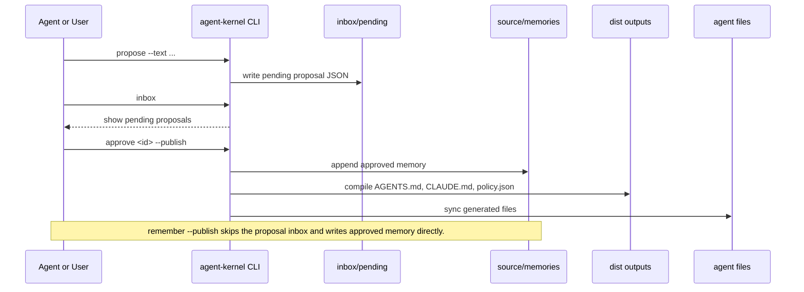
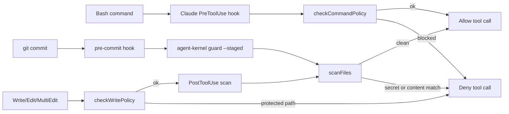
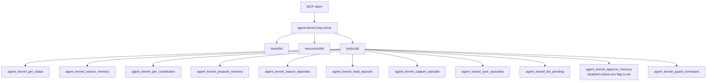

# Agent Kernel System Graph

This document maps the current runtime of `agent-kernel` as it exists today. It is not a product vision document.

## Current reality

`agent-kernel` is currently a single-file Node ESM CLI. Most runtime behavior lives in `src/cli.mjs`. The placeholder folders under `src/adapters`, `src/commands`, `src/core`, and `src/hooks` are not active modules yet.

## System graph

```mermaid
flowchart TD
    User[User] --> CLI[agent-kernel CLI\nsrc/cli.mjs]
    Agent[AI coding agent] --> Hooks[Claude hooks\nSessionStart, UserPromptSubmit, PreToolUse, PostToolUse]
    Agent --> MCP[MCP stdio server\nagent-kernel mcp serve]
    Agent --> Generated[Generated instruction files]

    CLI --> Home[AGENT_KERNEL_HOME\ndefault: ~/.agent-kernel]
    Hooks --> CLI
    MCP --> CLI

    Home --> Config[config.json]
    Home --> Source[source/]
    Home --> Inbox[inbox/]
    Home --> Episodes[episodes/]
    Home --> Dist[dist/]
    Home --> Logs[logs/]
    Home --> Skills[skills/]

    Source --> Memories[source/memories/*.json\nrules, preferences, workflows, project notes, skills]
    Source --> Policies[source/policies/policies.json]
    Source --> Schemas[source/schemas/*.schema.json]

    Inbox --> Pending[pending proposals]
    Inbox --> Approved[approved proposals]
    Inbox --> Rejected[rejected proposals]

    Episodes --> Archive[archive/*.json]
    Episodes --> Index[index.json]
    Episodes --> Sources[sources.json]

    CLI --> Compile[compile]
    Compile --> Dist
    Dist --> AgentsMD[AGENTS.md]
    Dist --> ClaudeMD[CLAUDE.md]
    Dist --> CursorRule[cursor-rule.mdc]
    Dist --> GeminiMD[GEMINI.md]
    Dist --> SkillsMD[SKILLS.md]
    Dist --> PolicyJSON[policy.json]

    CLI --> Sync[sync]
    Sync --> CodexHome[~/.codex/AGENTS.md]
    Sync --> ClaudeHome[~/.claude/CLAUDE.md]
    Sync --> GeminiHome[~/.gemini/GEMINI.md]

    CLI --> Link[link project]
    Link --> ProjectFiles[project AGENTS.md, GEMINI.md, .cursor/rules, .agents]

    CLI --> Guard[guard]
    Guard --> FileScan[file scan\nsecret patterns and content policies]
    Hooks --> CommandGuard[command guard\nBash deny patterns]
    CommandGuard --> PolicyJSON
    FileScan --> PolicyJSON
```



## Memory and approval lifecycle



## Enforcement flow



## MCP surface



## Current weak points visible from the graph

1. The runtime is centered on one large `src/cli.mjs` file. This keeps shipping simple, but it concentrates memory, compilation, hooks, guard logic, MCP, and command routing in one place.
2. The generated instruction layer and the enforcement layer are not equal in coverage. Most agents receive files. Claude receives hooks. Other agents mostly depend on reading generated files.
3. The policy guard is regex-based. It can catch obvious bad patterns, but it is not a full policy engine.
4. The memory system accepts direct approved writes through `remember`. The proposal workflow exists, but it is not the only path into approved memory.
5. Episode sync stores local conversation text. This is useful for recall, but privacy, redaction, and retention controls need stronger defaults before daily heavy use.
6. Project linking writes generated files into a target repo. This needs safer merge, backup, and checksum behavior before being trusted on sensitive projects.
7. MCP exposes useful tools, but not every CLI command. The public wording should avoid implying complete command parity until that is true.
8. Tests cover smoke behavior, not deep policy bypasses, corrupt JSON recovery, hook compatibility, project linking safety, or cross-agent fixtures.

## Recommended next architecture move

Do not jump straight to a full rewrite. First split `src/cli.mjs` along risk boundaries:

```text
src/core/paths.mjs
src/core/json-store.mjs
src/core/memory-store.mjs
src/core/compile.mjs
src/core/policy.mjs
src/core/episodes.mjs
src/core/mcp.mjs
src/adapters/claude.mjs
src/adapters/codex.mjs
src/adapters/cursor.mjs
src/commands/*.mjs
```

The first extraction should be `policy`, `json-store`, and `compile`, because bugs there affect safety, persistence, and generated outputs.
